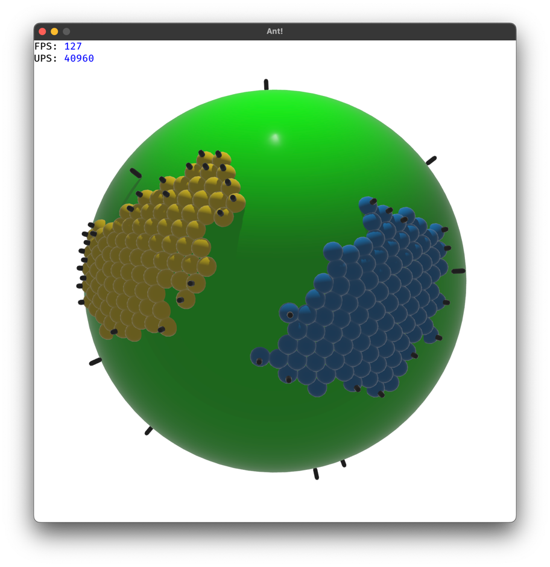
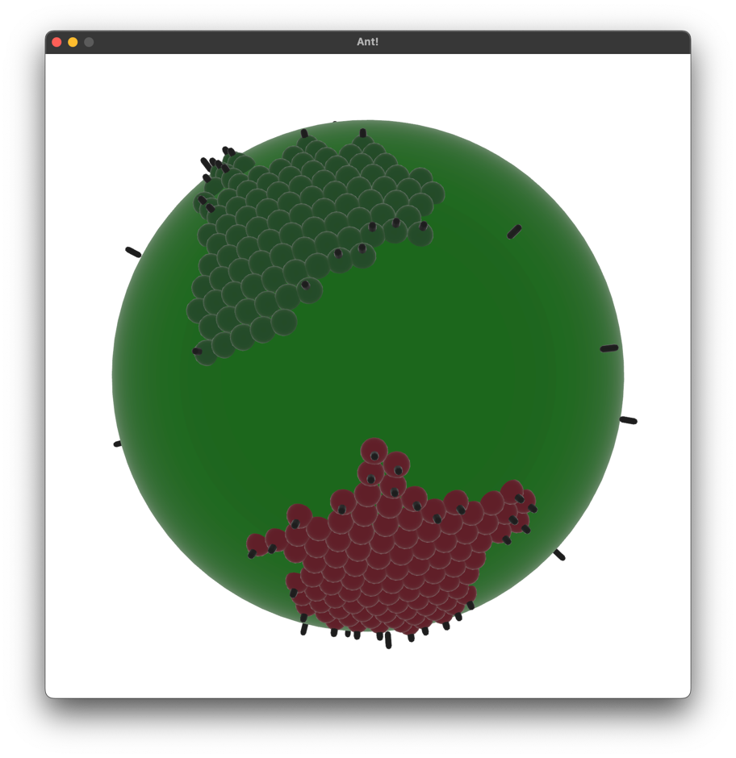
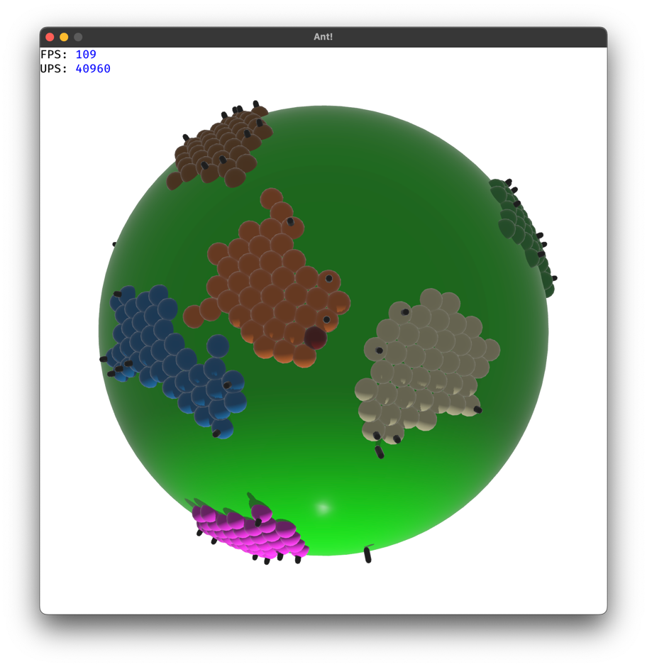
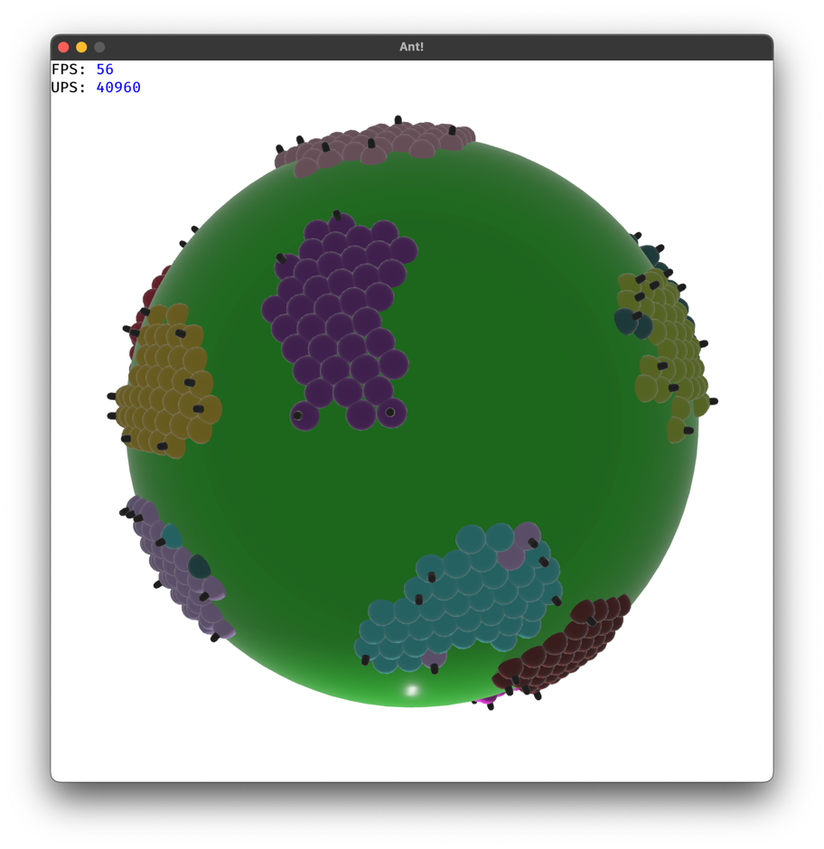

# IAR-Ant

Simulation of Ant based clustering using Rust and Bevy.

## 4 grupos e raio 1

## 15 grupos e raio 1

## Probability Function

A probabilidade de pegar e largar items é dada pelas seguinte fórmula encontrada no artigo "Ant-based Clustering Algorithms: A Brief
Survey" de O.A. Mohamed Jafar e R. Sivakumar

o parametro alpha foi ajustado empiricamente para um valor de 10.0 para a base de 4 grupos e 1.5 para a base de 15 grupos