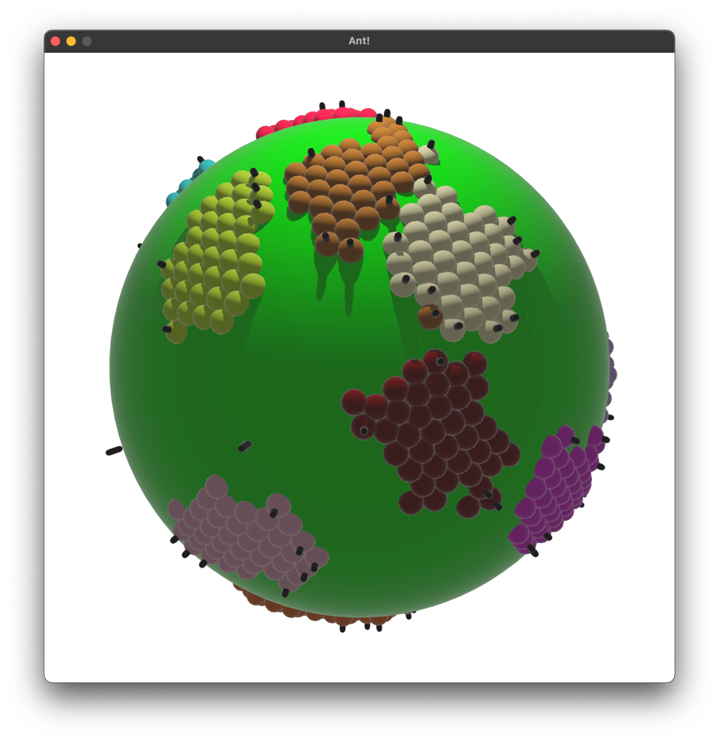
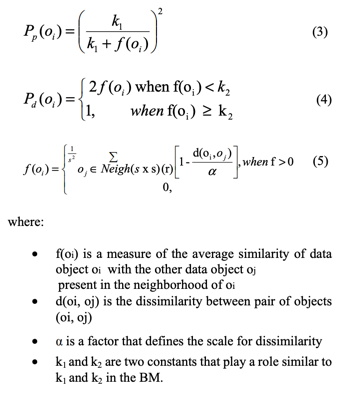
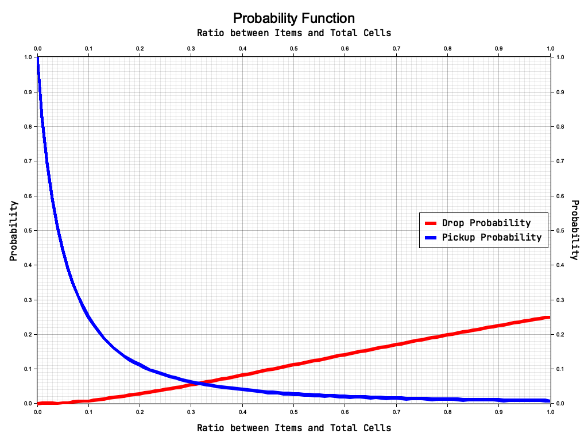

# IAR-Ant

Simulation of Ant based clustering using Rust and Bevy.

### Equação de probabilade

Para cada individuo a probabilidade de pegar ou largar um item foi calculada da seguinte maneira:

O gráfico abaixo mostra a relação entre a razão de items visiveis e a probabilidade

### Raio de visão

Foram realizadas três simulações

Uma com raio um (6 células visiveis)

Uma com raio dois (19 células visiveis)

Uma com raio três (31 células visiveis)

