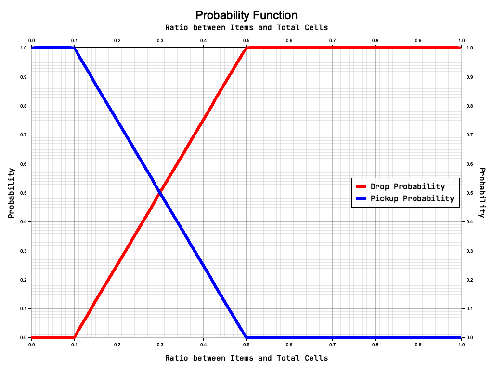

# IAR-Ant

Simulation of Ant based clustering using Rust and Bevy.

## Gifs

## Probability Function

For each entity, the probability to pick up or drop an item is calculated by:

The plot bellow exemplifies the relation between the ratio of visible items and the probability

